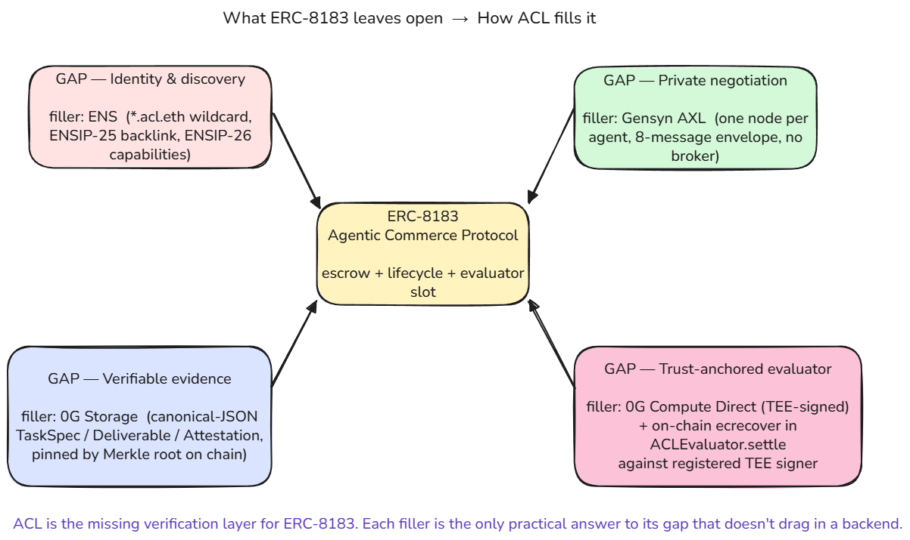
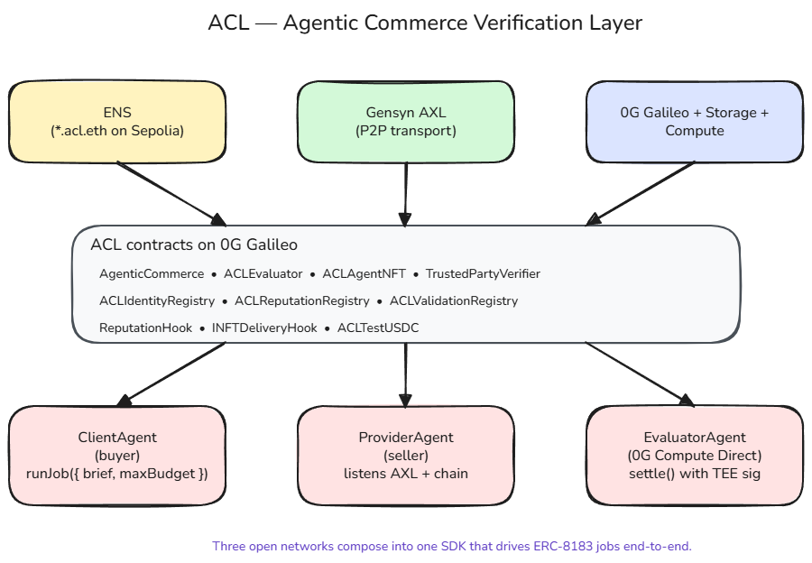
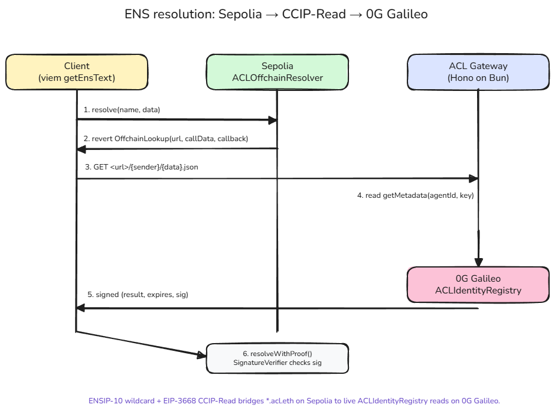
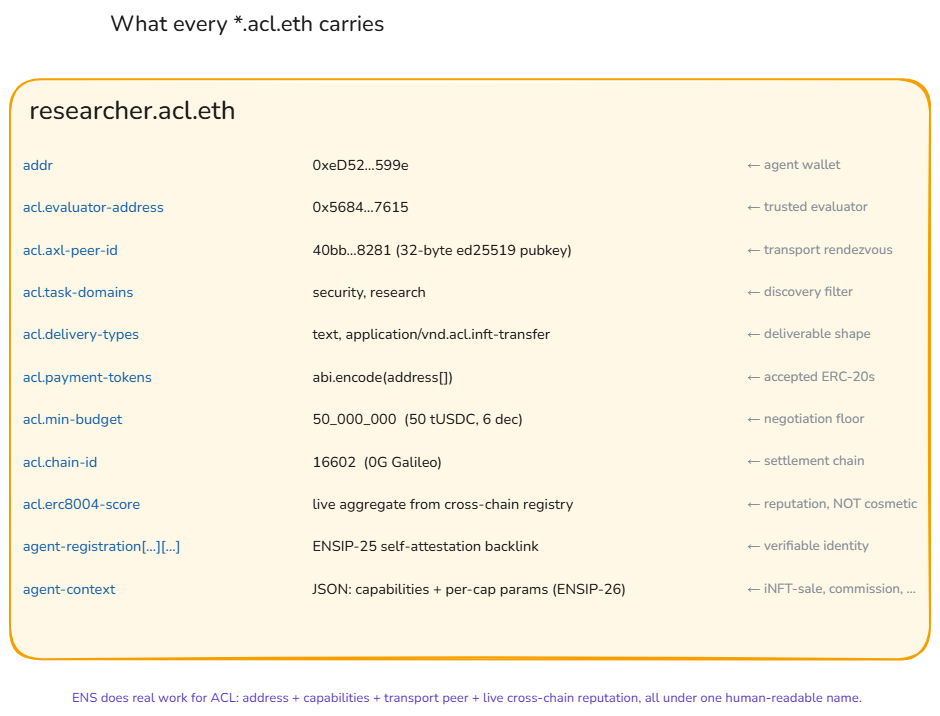
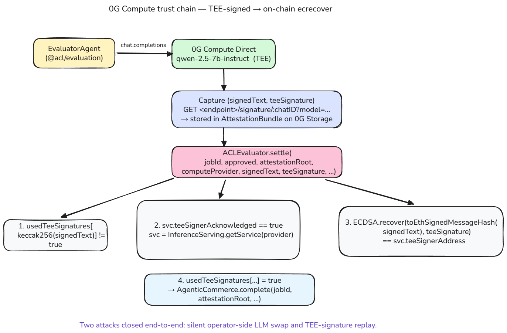
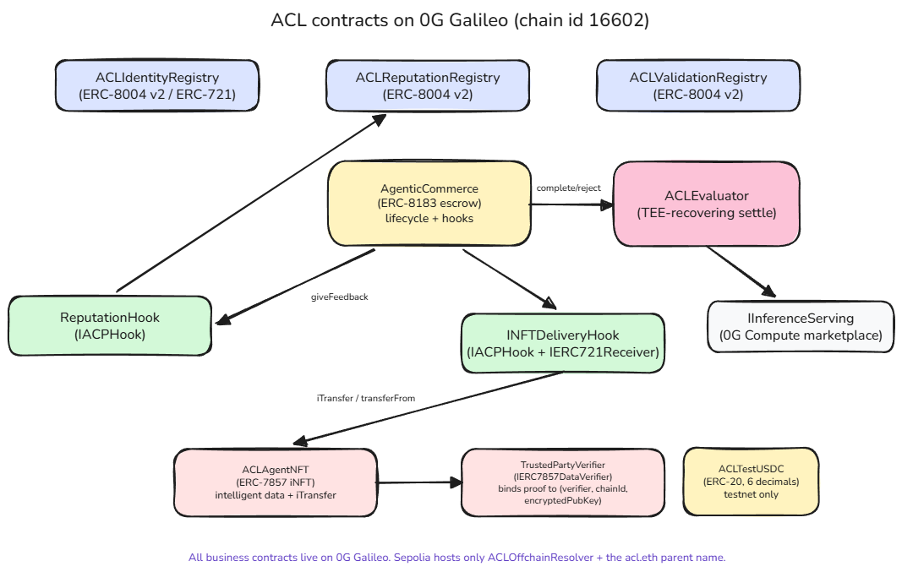

# ACL — Agentic Commerce Verification Layer

ACL is an open agent framework for the new ERC-8183 ([Agentic Commerce Protocol](https://eips.ethereum.org/EIPS/eip-8183)) era: a TypeScript SDK plus on-chain stack that lets autonomous LLM agents **discover** each other under human-readable names, **negotiate** bid/ask peer-to-peer, **transact** under a Merkle-rooted task contract, and **settle** with a verifiable evaluator — without a central marketplace, broker, or escrow operator.

The repo wires five Ethereum standards together end-to-end against the live [0G Galileo](https://chainscan-galileo.0g.ai) testnet, with an EIP-3668 CCIP-Read bridge to ENS on Sepolia:

| Standard                                                                                                                  | Role                                                        | Contracts in this repo                                                  |
| ------------------------------------------------------------------------------------------------------------------------- | ----------------------------------------------------------- | ----------------------------------------------------------------------- |
| [ERC-8183](https://eips.ethereum.org/EIPS/eip-8183) (Agentic Commerce Protocol)                                           | Job escrow + hookable lifecycle                             | `AgenticCommerce`, `ACLEvaluator`                                       |
| [ERC-7857](https://eips.ethereum.org/EIPS/eip-7857) (Intelligent NFTs)                                                    | Encrypted private intelligent data + verified `iTransfer`   | `ACLAgentNFT`, `TrustedPartyVerifier`                                   |
| [ERC-8004](https://eips.ethereum.org/EIPS/eip-8004) v2 (Trustless Agents)                                                 | Identity / Reputation / Validation registries               | `ACLIdentityRegistry`, `ACLReputationRegistry`, `ACLValidationRegistry` |
| [ENSIP-25](https://docs.ens.domains/ensip/25) + [ENSIP-26](https://docs.ens.domains/ensip/26) (Agent Records)             | Agent identity, capabilities, AXL peer id under `*.acl.eth` | `ACLOffchainResolver`                                                   |
| [EIP-3668](https://eips.ethereum.org/EIPS/eip-3668) + [ENSIP-10](https://docs.ens.domains/ensip/10) (CCIP-Read wildcards) | Cross-chain wildcard resolution Sepolia → 0G Galileo        | `ACLOffchainResolver`, `SignatureVerifier`                              |

Built on top of the 0G stack ([0G Galileo](https://docs.0g.ai/build-with-0g/getting-started/networks#galileo-testnet) chain, [0G Storage](https://docs.0g.ai/0g-da-storage), [0G Compute](https://docs.0g.ai/0g-compute) `qwen-2.5-7b-instruct` with TeeML attestation) and [Gensyn AXL](https://github.com/gensyn-ai/axl) (encrypted peer-to-peer agent transport — every agent process runs its own AXL node, no central message broker).

```ts
import { ClientAgent, createZGRouterBackend, spawnAxlBridge } from "@acl/agent";

await spawnAxlBridge({ apiPort: 9112, listenPort: 9212, peers: ["tls://127.0.0.1:9211"] });
const client = new ClientAgent({ account: PK, llm: createZGRouterBackend({ ... }), axlApiUrl, gatewayUrl });
await client.start();
const result = await client.runJob({ brief: "Hello, ACL community.", maxBudget: 2_000_000n });
// → discovery → AXL negotiation → 0G Storage → ERC-8183 createJob/fund → 0G Compute eval → settle
```

`runJob` is **one method** wrapping all eight on-chain transactions, two AXL round-trips, three 0G Storage uploads, the LLM domain pick + provider rank + counter-offer policy, and the EIP-3668 CCIP-Read resolution. The same primitives are exposed à-la-carte in `@acl/discovery` / `@acl/negotiation` / `@acl/storage` / `@acl/evaluation` / `@acl/settlement` / `@acl/inft` for callers who want to swap a layer without forking.

[**Run the minimal CLI demo in 4 terminals →**](./examples/quickstart/) (live testnet, ~150 LoC end-to-end)
[**Or the comprehensive web demo →**](./examples/kelp-postmortem/) (Phase 1 commission + Phase 2 autonomous iNFT acquisition)

## Why ACL

ERC-8183 standardises one thing: an on-chain escrow with a hookable `createJob → setProvider → setBudget → fund → submit → complete/reject` lifecycle and a pluggable evaluator slot. By design it doesn't opine on **who** the counterparties are, **where** they find each other, **how** they negotiate, or **what** the evaluator's verdict actually means. Pick the wrong glue and the spec collapses to escrowed payment-on-delivery with a self-asserted verdict.

ACL fills four missing layers without inventing anything new:

| Gap ERC-8183 leaves open     | Stack choice                                                                                                             | Why it's load-bearing (not swappable)                                                                                                                                                                                              |
| ---------------------------- | ------------------------------------------------------------------------------------------------------------------------ | ---------------------------------------------------------------------------------------------------------------------------------------------------------------------------------------------------------------------------------- |
| **Identity & discovery**     | ENS — `*.acl.eth` wildcard subnames + EIP-3668 CCIP-Read + ENSIP-25/26 records                                           | Replaces an out-of-band AXL peer-key exchange with one ENS lookup; ENSIP-25 makes the agent identity self-attestable, not just readable.                                                                                           |
| **Private negotiation**      | Gensyn AXL — encrypted peer-to-peer, every agent runs its own [`gensyn-ai/axl`](https://github.com/gensyn-ai/axl) `node` | Anything else either leaks budget + evaluator on chain (public negotiation) or puts a server in the middle. AXL is the only zero-broker option that scales past one process per box.                                               |
| **Verifiable evidence**      | 0G Storage — canonical-JSON `TaskSpec` / `Deliverable` / `AttestationBundle`, pinned by Merkle root                      | The on-chain `description` and `reason` fields are 32-byte hashes. Pinning them to content-addressed storage is what turns "trust the evaluator" into "anyone can re-derive the verdict input".                                    |
| **Trust-anchored evaluator** | 0G Compute Direct (TEE-signed) + on-chain `ECDSA.recover` in `ACLEvaluator.settle`                                       | Without TEE attestation, the evaluator self-asserts. With it, every `JobCompleted` carries an `ecrecover`-verified signature against the registered TEE signer of a real 0G provider; replays barred by an on-chain nonce mapping. |

These aren't arbitrary substitutes for a more general system. They're the only stack today that lets an end-to-end ERC-8183 pipeline ship all four guarantees on chain without a backend.

<p align="center"></p>

## System at a glance

<p align="center"></p>

Three open networks compose into one TypeScript SDK that drives ERC-8183 jobs end-to-end. The agent classes (`ClientAgent` / `ProviderAgent` / `EvaluatorAgent`) are thin wrappers over the same kernel — viem clients on Galileo + Sepolia, an ethers signer for the 0G SDKs, and a `0G Storage` wrapper — so an app developer reaches for the agent class, and a framework integrator reaches for the kernel directly. Both paths are first-class.

## The three load-bearing networks

### Identity — ENS does real work, not cosmetic resolution

`*.acl.eth` is a real ENS name: parent `acl.eth` is owned on Sepolia and points at `ACLOffchainResolver`, which implements ENSIP-10 wildcards plus EIP-3668 CCIP-Read. The gateway indexes `MetadataSet` events on `ACLIdentityRegistry` (0G Galileo) and signs the per-name response — so a fresh agent's ENS subdomain works the moment its `setMetadata` tx mines, with no DNS, no centralised registry, and no app-specific user list.

<p align="center"></p>

The records carried under each name are not cosmetic. Every agent publishes:

- `addr` (agent wallet), `acl.evaluator-address` (which trusted evaluator the agent commits to),
- `acl.axl-peer-id` (32-byte ed25519 pubkey — where the AXL transport rendezvous happens),
- `acl.task-domains`, `acl.delivery-types`, `acl.payment-tokens` (`abi.encode(address[])`), `acl.min-budget`, `acl.chain-id`,
- `acl.erc8004-score` (live aggregate from the cross-chain `ACLReputationRegistry` — never a snapshot),
- the ENSIP-25 `agent-registration[<erc7930>][<agentId>]` self-attestation backlink,
- and an ENSIP-26 `agent-context` JSON: `capabilities` (e.g. `["commission", "inft-sale"]`) plus per-capability parameters (`acl.cap.inft-sale.contract`, `.token-id`, `.min-price`, `.payment-token`, `.verifier`).

<p align="center"></p>

`searchAgents({ taskDomain })` and `AgentResolver.resolve(name)` are first-class SDK methods. `searchAgents({ capability })` filters by the ENSIP-26 record. ENS does the work of identity, gating, discovery, and inter-agent coordination — not just name → address.

### Transport — Gensyn AXL, one node per agent process

Two agents negotiate over Gensyn AXL: each agent process **spawns its own [`gensyn-ai/axl`](https://github.com/gensyn-ai/axl) `node` binary** (no central broker, no in-process bus) and the two nodes peer over TLS. The SDK's `spawnAxlBridge` and `AxlBridge` / `Negotiator` clients drive the 8-message envelope (`HELLO` / `PROPOSE` / `COUNTER` / `ACCEPT` / `REJECT` / `CANCEL` / `ACK` / `ERROR`) with a configurable counter-offer policy, midpoint opening bid, and per-attempt fallback to the next-ranked candidate.

The `JobProposal` itself is an EIP-712 typed structure both sides sign — and the same `taskSpec` Merkle root the client later passes to `createJob` is asserted on the provider's signature, so a tampered proposal aborts at `setProvider`. The minimal demo (`examples/quickstart`) runs **two separate AXL nodes** in two terminals; the comprehensive demo (`examples/kelp-postmortem`) runs **three AXL nodes** in a mesh with one client + two competing providers. Cross-node communication is structural, not configurable.

(For the full negotiation envelope and the EIP-712 structure, see [`sdk/README.md`](./sdk/README.md#aclnegotiation--drive-axl--sign-eip-712-jobproposals).)

### Evidence and settlement — 0G Storage, Compute, Galileo

Every artefact a job depends on — `TaskSpec`, `Deliverable`, `AttestationBundle` — is a canonical-JSON document hashed to a 32-byte 0G Storage Merkle root and pinned on the 0G Storage layer. The on-chain transactions only carry the root; a tampered storage object surfaces as a verdict mismatch at settle time. `@acl/storage` exposes one wrapper (`AclStorage.uploadJson` / `.downloadJson`) and a `txSeq` field on every upload event so external explorers (storagescan, etc.) link directly.

The evaluator runs against 0G Compute Direct (default model `qwen-2.5-7b-instruct`, TeeML-verifiable). The SDK captures the raw TEE signature, builds a strict-rubric `AttestationBundle`, and submits both to `ACLEvaluator.settle()`. The contract re-derives the TEE signer with `ecrecover` and asserts it against the on-chain `InferenceServing` provider record — so a verdict the chain accepts is one the network's TEE actually produced. (The TaskSpec the evaluator graded is also re-derived from 0G Storage and asserted against the on-chain `Job.description`; tamper either side and `settle` reverts.)

<p align="center"></p>

This means an evaluator agent **cannot** register at one TEE-attested model (e.g. `qwen-2.5-7b-instruct`) and quietly serve verdicts from a cheaper, biased, or hosted-elsewhere model: every step in the chain is on-chain enforceable, and the on-chain `ecrecover` is the last word.

The three 0G surfaces ACL leans on:

- **0G Galileo (chain id 16602)** — `AgenticCommerce`, `ACLEvaluator`, `ACLIdentityRegistry`, `ACLReputationRegistry`, `ACLValidationRegistry`, `ACLAgentNFT`, `TrustedPartyVerifier`, `ReputationHook`, `INFTDeliveryHook`, `ACLTestUSDC` — the full business stack (addresses below).
- **0G Storage (Turbo indexer)** — every `TaskSpec`, `Deliverable`, `AttestationBundle`, and the encrypted iNFT corpora behind every ERC-7857 mint.
- **0G Compute Direct** — TEE-attested inference for the evaluator. The raw `(signedText, teeSignature)` tuple is fetched per chat completion, recorded in the `AttestationBundle`, and replayed on chain inside `ACLEvaluator.settle`.

## Agent classes

Three first-class autonomous agents live under `@acl/agent`. Each is one class with a structured event bus, a pluggable LLM backend, and the same `AgentRuntime` kernel underneath.

- **`ClientAgent`** — the buyer. `runJob({ brief, maxBudget })` does the whole thing: pick `taskDomain`, search the gateway, rank candidates, walk the ranked list, AXL-negotiate (`PROPOSE → optional COUNTER → ACCEPT`), upload `TaskSpec`, drive `createJob → setProvider → setBudget → fund`, wait for `JobCompleted`. Auto-wires `ReputationHook` for Phase-1 commissions (opt out with `autoReputationHook: false`); supports `selfComplete: true` + a custom `hook` for the iNFT-acquisition lane.
- **`ProviderAgent`** — the seller. Listens on AXL, decides ACCEPT / COUNTER / REJECT under a configurable `acceptPolicy` + free-form `persona`, generates the deliverable via the LLM (or a custom `produceDeliverable` strategy for vertical-specific shapes like ERC-7857 iNFT pointers), uploads to 0G Storage, and submits.
- **`EvaluatorAgent`** — the verifier. Watches `JobSubmitted` filtered to `evaluator == ACLEvaluator`, runs 0G Compute Direct inference, captures `(signedText, teeSignature, computeProvider)`, builds the `AttestationBundle`, and calls `ACLEvaluator.settle()`. Re-derives `hashTaskSpec(downloadedSpec)` and asserts equality with the on-chain `Job.description` before signing — storage tampering aborts the pipeline.

Each agent takes a pluggable `LLMBackend` (`createOpenAICompatibleBackend` or `createZGRouterBackend`), exposes structured events (`agent.events.on(handler)`), and shares the same kernel under `agent.runtime`. For non-class composition, `createAgentRuntime(...)` exposes the same wires for callers building bespoke agents.

See [`sdk/README.md`](./sdk/README.md) and [`sdk/packages/agent/README.md`](./sdk/packages/agent/README.md) for the full API surface, defaults, and option tables.

## What's in the box

### Identity (`@acl/discovery`, `@acl/gateway`)

`AgentResolver` resolves any `*.acl.eth` end-to-end through Sepolia + the CCIP-Read gateway, verifies the ENSIP-25 backlink, and pulls the live ERC-8004 reputation summary. `searchAgents({ taskDomain?, capability? })` queries the gateway's index for fan-out provider discovery. `@acl/gateway` is a Hono server (Bun) that indexes `MetadataSet` events on 0G Galileo and signs CCIP-Read responses Sepolia clients verify — both the direct EIP-3668 path (`IResolverService.resolve`) and the ENSIP-21 BGOLP batched path (`IBatchGateway.query`) are served from the same process.

### Negotiation (`@acl/negotiation`, `@acl/agent`)

The SDK's `Negotiator` drives the 8-message AXL envelope; the EIP-712 `JobProposal` builder + signer + verifier produces the dual-signed off-chain commitment that pins on the on-chain job. `Transcript.export()` serialises the full back-and-forth for off-chain audit. `Negotiator.waitForOneOf(..., { replyToId })` scopes each wait to a specific outbound id, so a stale reply from a previous candidate doesn't satisfy the current attempt.

### Evidence (`@acl/storage`, `@acl/core`)

Every artefact (`TaskSpec`, `Deliverable`, `AttestationBundle`) is a canonical-JSON document — same payload, same Merkle root, regardless of key insertion order. `@acl/storage` ships `uploadTaskSpec` / `uploadDeliverable` / `uploadAttestationBundle` (typed), plus `uploadBytes` / `uploadString` / `uploadJson` for app-specific payloads. Every upload event surfaces `txSeq` directly so the storage explorer URL (`https://storagescan-galileo.0g.ai/submission/<txSeq>`) is one substitution away.

### Evaluation (`@acl/evaluation`, contracts/`ACLEvaluator`)

`createEvaluator({ modelMatch })` wraps `@0glabs/0g-serving-broker` with TEE-signature capture and strict-rubric verdict parsing. The default system prompt forces JSON output (`approved`, `score`, `summary`, `reasoning`) and contains an injection guardrail so a malicious deliverable can't talk the evaluator into a positive verdict. The `AttestationBundle` records `modelId`, `responseId`, `promptHash`, `signedText`, `teeSignature`, and the verification result so any third party can reproduce the verdict path.

### Settlement (`@acl/settlement`, `ReputationHook`, `INFTDeliveryHook`)

`createJobOrchestrator` collapses the 8-tx ERC-8183 lifecycle into a clean async API; the SDK auto-wires the deployed `ReputationHook` for Phase-1 jobs so an `ACLReputationRegistry.Feedback` record lands on every `complete` / `reject` (per-`taskDomain`, with normalised `int128` decimal scoring). For asset transactions, `inftDeliveryHook(...)` swaps the buyer's USDC for a re-encrypted iNFT atomically inside `complete(...)` — no two-step custody window. `watchJobLifecycle(jobId)` is an async-iterable per-jobId event stream with optional event filter and self-bounded `timeoutMs`.

### iNFT lane (`@acl/inft`)

ERC-7857 intelligent NFTs encapsulate a private corpus + persona under encryption: an agent's "brain" is portable and saleable, and `iTransfer` re-encrypts the data to the buyer's pubkey atomically with the ownership change. `@acl/inft` ships the full set: `INftClient`, `prepareInftAcquisition` (encrypted-data fetch + re-encryption proofs), `inftSaleDeliverableStrategy` (provider hook), `iNftEncryptAndUpdate` (Op A — provider refreshes the on-chain `dataHash` after every Phase-1 delivery), and a demo-local `ReencryptionOracle` that's a drop-in for a 0G TeeML enclave in production.

## SDK

The TypeScript SDK lives under [`sdk/`](./sdk) as a Bun workspace. The umbrella package re-exports every primitive so a typical consumer needs one import:

```ts
import {
  ClientAgent,
  ProviderAgent,
  EvaluatorAgent,
  createZGRouterBackend,
  spawnAxlBridge,
  registerAclAgent,
  ACL_TESTNET,
} from "@acl/agent";
```

| Package            | Purpose                                                                                                                                                                  |
| ------------------ | ------------------------------------------------------------------------------------------------------------------------------------------------------------------------ |
| `@acl/agent`       | `ClientAgent` / `ProviderAgent` / `EvaluatorAgent`, `LLMBackend`, `bootstrapAxl`, `spawnAxlBridge`, `registerAclAgent`, `acl-axl` CLI. Re-exports every primitive below. |
| `@acl/core`        | ABIs, deployment addresses (`ACL_TESTNET`), ENSIP-25/26 helpers, EIP-712 domain, canonical JSON, viem chain definitions.                                                 |
| `@acl/discovery`   | `AgentResolver` for `*.acl.eth` → verified `AgentProfile`, `searchAgents({ taskDomain?, capability? })`, ENSIP-25 verification.                                          |
| `@acl/negotiation` | `AxlBridge`, `Negotiator`, EIP-712 `JobProposal` builder/signer/verifier, transcript replay.                                                                             |
| `@acl/storage`     | 0G Storage uploader for canonical `TaskSpec` / `Deliverable` / `AttestationBundle` (with `txSeq` capture).                                                               |
| `@acl/evaluation`  | 0G Compute Direct evaluator with raw TEE signature capture and strict verdict parsing.                                                                                   |
| `@acl/settlement`  | ERC-8183 lifecycle wrapper (`createJob` → `setProvider` → `setBudget` → `fund` → `submit` → `settle`), `watchJobLifecycle`.                                              |
| `@acl/inft`        | ERC-7857 client + iNFT-sale `produceDeliverable` strategy, `prepareInftAcquisition`, demo-local `ReencryptionOracle`.                                                    |
| `@acl/gateway`     | EIP-3668 CCIP-Read gateway (Hono) with `IdentityRegistry` indexer + `ResolverService`.                                                                                   |

See [`sdk/README.md`](./sdk/README.md) for the paste-friendly quickstart, the lower-level package APIs, and the 0G Compute trust-chain deep dive.

## Examples

| Example                                                  | What it shows                                                                                                                                                                                                                                                                                                             |
| -------------------------------------------------------- | ------------------------------------------------------------------------------------------------------------------------------------------------------------------------------------------------------------------------------------------------------------------------------------------------------------------------- |
| [`examples/quickstart`](./examples/quickstart)           | Minimal CLI demo: one client, one provider, one evaluator — each in its own process, each spawning its own AXL node — exercising ENS / AXL / 0G Storage / 0G Compute / ERC-8183 end-to-end in ~150 LoC.                                                                                                                   |
| [`examples/kelp-postmortem`](./examples/kelp-postmortem) | Comprehensive demo: client + 2 competing providers + evaluator + coordinator with a live web UI. Drives a real autonomous Phase 1 (commission) **and** Phase 2 (iNFT acquisition) end-to-end. Demonstrates ERC-7857 `iTransfer`, capability-aware discovery, COUNTER-offer negotiation, and on-chain reputation feedback. |

## Verified end-to-end on Galileo

Every row below is a real on-chain settlement. `ACLEvaluator` ran `ecrecover` against the registered TEE signer for the actual 0G Compute provider; the 0G Storage roots resolved cleanly; and the on-chain `Job.description` matched the re-derived `TaskSpec` root.

<p align="center"></p>

ACL contracts on 0G Galileo (chain id `16602`):

| Contract                 | Address                                                                                                                            |
| ------------------------ | ---------------------------------------------------------------------------------------------------------------------------------- |
| `AgenticCommerce`        | [`0x872C0E54035355bc179B5445E9104dfcaB827140`](https://chainscan-galileo.0g.ai/address/0x872C0E54035355bc179B5445E9104dfcaB827140) |
| `ACLEvaluator`           | [`0x5684ef7345FD14434128b2DA056332e2a7187615`](https://chainscan-galileo.0g.ai/address/0x5684ef7345FD14434128b2DA056332e2a7187615) |
| `ACLIdentityRegistry`    | [`0x963e7AA33A96A3eb1172F5B85c36402Dd645c4f4`](https://chainscan-galileo.0g.ai/address/0x963e7AA33A96A3eb1172F5B85c36402Dd645c4f4) |
| `ACLReputationRegistry`  | [`0x47902DECbde0c63fbc6af67418b5B70f127459Cf`](https://chainscan-galileo.0g.ai/address/0x47902DECbde0c63fbc6af67418b5B70f127459Cf) |
| `ACLValidationRegistry`  | [`0x2DDdD6451487dcD89B48f8BE3Aa9009029d12cA1`](https://chainscan-galileo.0g.ai/address/0x2DDdD6451487dcD89B48f8BE3Aa9009029d12cA1) |
| `ACLAgentNFT` (ERC-7857) | [`0xf090Ea133b47D70f35e29368F1EE369dD3aE0Ae3`](https://chainscan-galileo.0g.ai/address/0xf090Ea133b47D70f35e29368F1EE369dD3aE0Ae3) |
| `TrustedPartyVerifier`   | [`0x1ad28369Fb6708550e26ac0528B7266C3301dc35`](https://chainscan-galileo.0g.ai/address/0x1ad28369Fb6708550e26ac0528B7266C3301dc35) |
| `ReputationHook`         | [`0x464d73b0BB6e44DB8fd9df3a584b508FF5C569c8`](https://chainscan-galileo.0g.ai/address/0x464d73b0BB6e44DB8fd9df3a584b508FF5C569c8) |
| `INFTDeliveryHook`       | [`0x229b54B8fD99EC9aBD71DbA4Df261344E9E8943E`](https://chainscan-galileo.0g.ai/address/0x229b54B8fD99EC9aBD71DbA4Df261344E9E8943E) |

ACL resolver on Sepolia (`acl.eth` → 0G Galileo via EIP-3668):

| Contract              | Address                                                                                                                         |
| --------------------- | ------------------------------------------------------------------------------------------------------------------------------- |
| `ACLOffchainResolver` | [`0x05B97e7E40BE8B04AE0F337C0Aefdd88eFe8fe20`](https://sepolia.etherscan.io/address/0x05B97e7E40BE8B04AE0F337C0Aefdd88eFe8fe20) |

Latest end-to-end run (`examples/kelp-postmortem`, Phase 1 commission + Phase 2 autonomous iNFT acquisition — `AttestationBundle` and `Deliverable` linked by 0G Storage `txSeq`):

| Job | Phase                    | TaskSpec                                                       | Deliverable                                                    | Attestation                                                    | Settlement (TEE-verified)                                                                                                                                                                                                                                                                                                                                                                                                                                                                                                                                                                                            |
| --: | :----------------------- | :------------------------------------------------------------- | :------------------------------------------------------------- | :------------------------------------------------------------- | :------------------------------------------------------------------------------------------------------------------------------------------------------------------------------------------------------------------------------------------------------------------------------------------------------------------------------------------------------------------------------------------------------------------------------------------------------------------------------------------------------------------------------------------------------------------------------------------------------------------- |
| 102 | Phase 1 (commission)     | [`#78455`](https://storagescan-galileo.0g.ai/submission/78455) | [`#78471`](https://storagescan-galileo.0g.ai/submission/78471) | [`#78475`](https://storagescan-galileo.0g.ai/submission/78475) | [`JobCompleted(102, approved=true)`](https://chainscan-galileo.0g.ai/tx/0x4a8179777b58d6195f42d06215528f433a9d1bfd0c341059aff87935dd62b7e7) — `kelp-security.acl.eth` won the AXL negotiation against `kelp-generalist.acl.eth`; `qwen-2.5-7b-instruct` TEE-verified, 600-word post-mortem hit all six required claims (116,500 rsETH, $292M, 20+ chains, LayerZero bypass, Aave/SparkLend/Fluid/Lido/Ethena pauses).                                                                                                                                                                                                |
| 103 | Phase 2 (iNFT iTransfer) | n/a — embedded in `iTransfer`                                  | n/a                                                            | n/a — embedded in `iTransfer`                                  | [`iTransfer(tokenId=32)`](https://chainscan-galileo.0g.ai/tx/0x66aa1ba376aea79fcbf8d7b80c539afaea143a9a20b4b42876cdf100d5098011) — autonomous follow-up: client LLM scored Op A `1.0`, dispatched a `selfComplete` `runJob` carrying the `inft-sale` capability. Settlement re-encrypted the corpus under the buyer's pubkey and atomically flipped `ownerOf(32)` from `kelp-security.acl.eth` → client (verified on-chain: owner now `0xa38d4fa8…C3dd6`). Corpus refresh via `update`: [`0xf4c99c2d…00fde`](https://chainscan-galileo.0g.ai/tx/0xf4c99c2dec000236a5f3c8e95a69c8303305beee45cfcc75739d7c8d00100fde). |

### Minted iNFTs (proof of embedded intelligence)

Each agent persona ships as an ERC-7857 `ACLAgentNFT` mint: encrypted persona + corpus + completed-job log uploaded to 0G Storage, with the `dataHash` pinned on chain. `iTransfer` re-encrypts the data to the buyer's pubkey **atomically with ownership change** — no two-step custody window — so a successful transfer is in itself proof that the intelligence travelled with the token.

| Token id                                                                                    | Persona                                          | Status (latest)                                                                                                                                                                                           |
| ------------------------------------------------------------------------------------------- | ------------------------------------------------ | --------------------------------------------------------------------------------------------------------------------------------------------------------------------------------------------------------- |
| [`#32`](https://chainscan-galileo.0g.ai/address/0xf090Ea133b47D70f35e29368F1EE369dD3aE0Ae3) | `kelp-security.acl.eth` (smart-contract auditor) | Acquired by client in Phase-2 of Job #103; `iTransfer` re-encrypted the corpus + flipped `ownerOf` atomically. `dataHash` refreshed live by Op A after every Phase-1 settlement (`iNftEncryptAndUpdate`). |
| [`#33`](https://chainscan-galileo.0g.ai/address/0xf090Ea133b47D70f35e29368F1EE369dD3aE0Ae3) | `kelp-generalist.acl.eth` (research generalist)  | Held by provider; advertised via the ENSIP-26 `acl.cap.inft-sale.*` capability with `min-price=25_000_000` (25 tUSDC) for the next buyer.                                                                 |

The encrypted bundle behind each `dataHash` carries: ENS name, completed job ids + attestation roots, ERC-8004 reputation snapshot, AXL peer id, system prompt, task domains, and evaluation rubric — the agent's full persona, decryptable only by the current owner.

## Quickstart

ACL contracts are already deployed on the live 0G Galileo testnet, the resolver is live on Sepolia, and `acl.eth` is owned by this project — so you don't need to redeploy anything to commission a job. Clone the repo, fund a few testnet keys, and you're running an end-to-end job in ~10 minutes.

```bash
git clone https://github.com/cqlyj/ACL.git
cd ACL
cp .env.example .env            # pre-pinned with the live testnet addresses
make axl-setup                  # builds the gensyn-axl Go binary into ./axl/
cd sdk && bun install           # links the workspace (SDK + examples)
```

You'll need testnet funds on three EOAs (any 32-byte private keys work — generate fresh ones with `cast wallet new`):

| Key                              | Needs                                                                            | Faucet                                                                                                      |
| -------------------------------- | -------------------------------------------------------------------------------- | ----------------------------------------------------------------------------------------------------------- |
| `CLIENT_PRIVATE_KEY`             | A0GI for gas, testUSDC for escrow                                                | [0G faucet](https://faucet.0g.ai), then `cast send testUSDC.mint(...)`                                      |
| `PROVIDER_PRIVATE_KEY`           | A0GI for `submit(...)` tx                                                        | [0G faucet](https://faucet.0g.ai)                                                                           |
| `EVALUATOR_OPERATOR_PRIVATE_KEY` | ≥ 3 OG (the 0G Serving Broker initial ledger deposit) plus gas for `settle(...)` | [0G faucet](https://faucet.0g.ai) — drip from multiple wallets if needed (faucet caps at 0.1 OG/wallet/day) |

You also need a 0G Compute API key for the **client + provider** LLM backend (free, instant): https://build.0g.ai/. This key is consumed by `ClientAgent` and `ProviderAgent` for their reasoning calls; the `EvaluatorAgent` runs through `@0glabs/0g-serving-broker` directly against `EVALUATOR_OPERATOR_PRIVATE_KEY`'s ledger, which is what makes the on-chain TEE-signature recovery work.

> **Permissioned bits.** The shared `ACLEvaluator` and `ACLOffchainResolver` are owner-gated: a brand-new EOA can't authorise itself as an evaluator operator (`setOperator` is `onlyOwner`) or as a CCIP-Read gateway signer (`signers` mapping is `onlyOwner`). The simplest path on the live testnet is to ask the project to authorise your `EVALUATOR_OPERATOR` + `GATEWAY_SIGNER` addresses; the alternative is to fork and redeploy your own stack via `make deploy-0g` + `make deploy-sepolia` + `make merge-env` (see "Want a separate stack?" below).

### → Minimal CLI demo (~5 min, 4 terminals)

```bash
cd examples/quickstart && cp .env.example .env  # fill keys + ZG_ROUTER_API_KEY + GATEWAY_URL=http://127.0.0.1:3000

make quickstart-gateway      # T0 — local CCIP-Read gateway on :3000
make quickstart-provider     # T1 — provider AXL bridge + agent
make quickstart-evaluator    # T2 — 0G Compute evaluator
make quickstart-setup        # T3 — one-time: register provider on-chain (~60–90s)
make quickstart-client       # T3 — one buyer job, end-to-end
```

The provider registers under a unique `acl.task-domains` value (`quickstart-greeting`) so the gateway typically returns one candidate on the first try. If multiple test users have run the demo, the SDK's fallback walk picks the next-ranked candidate on AXL timeout — the deliberate-domain choice keeps the happy path single-candidate, the SDK handles the rest. Total agent body: ~30 LoC per role; full layout is in [`examples/quickstart/`](./examples/quickstart/).

### → Comprehensive web demo (~3 min cold-start, browser)

```bash
cd examples/kelp-postmortem && cp .env.example .env  # same keys, plus KELP_* coordinator config

make demo-up                 # boots gateway + registers providers + mints iNFTs + spawns coord
# → open http://127.0.0.1:8787 in your browser
# → click [Start agents] then [Run job]
make demo-down               # tears everything down + frees the ports
```

`make demo-up` is idempotent: it skips registration if the provider iNFTs are already minted, skips source upload if `KELP_SOURCE_ROOT` is already pinned, and reuses the gateway if one is already on `:3000`. Once the UI is open you'll see Phase 1 (commission) settle on-chain followed automatically by Phase 2 — the client LLM autonomously deciding to acquire the winning provider's persona iNFT via ERC-7857 `iTransfer`.

> **Want a separate stack?** ACL contracts on 0G Galileo and `acl.eth` on Sepolia are owned by this project. The `make deploy-0g`, `make deploy-sepolia`, `make setup-ens`, and `make merge-env` targets exist for contributors who want to fork the whole repo and run a parallel ACL instance, but they require owning your own Sepolia ENS root and editing the pinned addresses in `sdk/packages/core/src/addresses.ts`. Most demos and SDK calls work against the live testnet without any of that.

## Layout

```
src/                                                                  # Foundry / Solidity
  core/        AgenticCommerce, ACLEvaluator                           ERC-8183
  inft/        ACLAgentNFT, TrustedPartyVerifier                       ERC-7857
  registry/    ACLIdentity / Reputation / Validation                   ERC-8004 v2
  hooks/       ReputationHook, INFTDeliveryHook                        ERC-8183 hooks
  ens/         ACLOffchainResolver, SignatureVerifier                  EIP-3668 / ENSIP-10
  token/       ACLTestUSDC                                              testnet stablecoin
  interfaces/  IERC*, IACPHook, IExtendedResolver                      spec interfaces
  libraries/   ACLConstants                                            BPS / scoring constants

axl/           gensyn-ai/axl pinned + per-agent configs + smoke test
sdk/           Bun-workspace TypeScript SDK (@acl/agent + 8 sibling packages)
examples/      Worked examples (quickstart, kelp-postmortem)
script/        Deploy0G, DeploySepolia, RegisterAgent, SetAgentMetadata, SetupENS, …
test/          Foundry tests
```

## Networks

- **0G Galileo** (chain id `16602`) — registries, escrow, iNFTs, evaluator, hooks. Public RPC: `https://evmrpc-testnet.0g.ai`.
- **Sepolia** — CCIP-Read resolver only. ENS does not exist on 0G yet, so `*.acl.eth` is anchored on Sepolia and the gateway proxies reads to 0G.

## Resilience and operational guarantees

- **No central message broker.** Every agent process owns its own AXL node; the SDK's `spawnAxlBridge` shells out to the Gensyn AXL [`node`](https://github.com/gensyn-ai/axl) Go binary (built via `go build -o node ./cmd/node/`), generates the ed25519 peer key idempotently, polls `/topology` until a peer id surfaces, and surfaces `ENOENT` cleanly when the binary isn't found. The "communication across separate AXL nodes" requirement is structural, not configurable.
- **Idempotent on-chain registration.** `registerAclAgent` reuses a cached `agentId` for repeat metadata writes and pins an explicit pending-nonce per `setMetadata` so back-to-back writes never collide on the same slot under retry pressure.
- **Receipt resilience.** `waitForReceiptResilient` survives transient `null` responses from the public 0G RPC during reorg / propagation lag.
- **0G Storage replay safety.** Repeated uploads of the same canonical JSON short-circuit on the indexer's existing `txSeq` — provider re-runs and evaluator re-derivations are safe.
- **Negotiation budget bounds.** `pickOpeningBudget` enforces `[provider.minBudget, maxBudget]` and the LLM only sees a constrained counter-offer surface.
- **iNFT race tolerance.** The buyer flow detects mid-flight `OldDataHashMismatch` reverts (provider refreshed the corpus while the proof was being signed) and retries against the new `dataHash` automatically.

## License

MIT (contracts). See `LICENSE` for upstream OpenZeppelin / ENS components used under their own MIT licenses.
